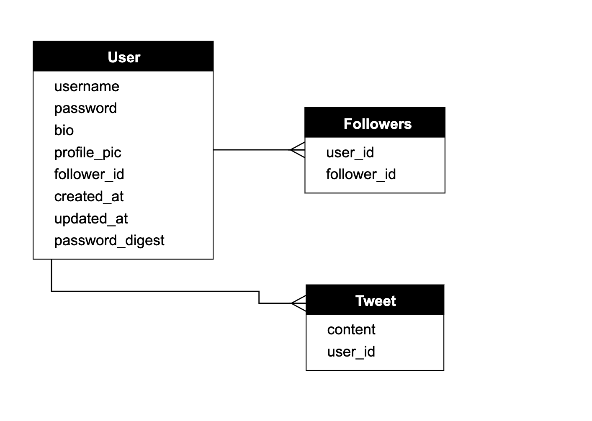

# Plan

- The client issues a request for the /users URL.
- Rails routes /users to the index action in the Users controller.
- The index action asks the User model to retrieve all users (User.all).
- The User model pulls all the users from the database.
- The User model returns the list of users to the controller.
- The controller captures the users in the @users variable, which is passed to the index view.
- The view uses embedded Ruby to render the page as HTML.
- The controller passes the HTML back to the browser.

- Both User model and the Peep model inherit '<' from ApplicationRecord
- ApplicationRecord inherits from ActiveRecord::Base
- ActiveRecord::Base is the base class for models provided by Active Record
- Inheriting from ActiveRecord::Base let model objects gain the ability to communicate with the database
- Treat the database columns as Ruby attributes
